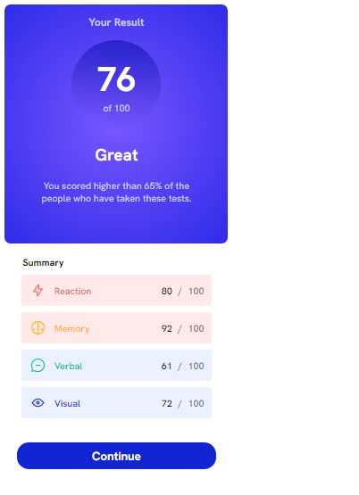

# Frontend Mentor - Results summary component solution

This is a solution to the [Results summary component challenge on Frontend Mentor](https://www.frontendmentor.io/challenges/results-summary-component-CE_K6s0maV). Frontend Mentor challenges help you improve your coding skills by building realistic projects. 

## Table of contents

- [Overview](#overview)
  - [The challenge](#the-challenge)
  - [Screenshot](#screenshot)
  - [Links](#links)
- [My process](#my-process)
  - [Built with](#built-with)
  - [What I learned](#what-i-learned)
  - [Continued development](#continued-development)
  - [Useful resources](#useful-resources)
- [Author](#author)
- [Acknowledgments](#acknowledgments)

## Overview

This is my second frontedmentor.io challenge. I hope this proyect satisfies the requeriments and being similar with the original design.

### The challenge

Users should be able to:

- View the optimal layout for the interface depending on their device's screen size
- See hover and focus states for all interactive elements on the page

### Screenshot

Here's the screenshot of the design, both 1080px and mobile design.

### Links

- Solution URL: [Add solution URL here](https://your-solution-url.com)
- Live Site URL: [Add live site URL here](https://your-live-site-url.com)

## My process

### Built with

- Semantic HTML5 markup
- CSS custom properties
- Flexbox
- Mobile-first workflow

### What I learned

In this proyect I reinforce my skills on css and html. However, I tried to use javascript in order to import json file, but I gave up. So, I only coppied table elements from json file. I hope in the near future I'll be able to work with Fetch, javascript and PHP.

### Continued development

I need to improve in Javascript, as well as Fetch API, PHP and I hope in neae future React.

### Useful resources

- [Nice Converter](https://nice-converter.com/color/hsl-to-hex) - I found useful this website to convert hsl and hsla to HEX o RGA

## Author

- Website - Jacob Gomez Carrillo - https://github.com/tchock42
- Frontend Mentor - @tchock42 - https://www.frontendmentor.io/profile/tchock42

## Acknowledgments

I work alone in the meantime I am learning. I the professional future, I expect to have a work team. So, now all the credit is for me.
